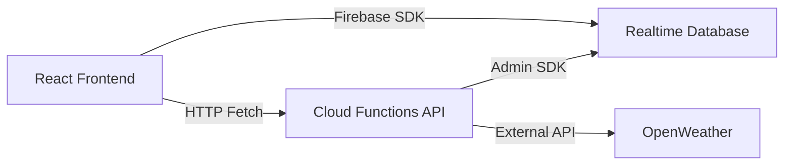

# User Endpoints — Firebase + React

> Take-home challenge implementation showing Firebase expertise, clean architecture, and React integration.

---

## 📌 Overview

This project implements user CRUD functionality using **Firebase Realtime Database** and **Firebase Cloud Functions**, with a **React (Vite)** front end.  

The key idea: **don’t rebuild what Firebase already provides.**

- **Reads** use the Realtime Database SDK directly → instant, live updates.
- **Writes/Updates/Deletes** go through Cloud Functions → enrich data securely (ZIP → Lat/Lon + Timezone) while hiding API keys.

This keeps the solution lean, efficient, and Firebase-native.

---

## 🏗️ Architecture



- Realtime Database → stores user records.
- Cloud Functions (Express app) → handles POST/PATCH/DELETE, enriches with OpenWeather + tz-lookup.
- React Frontend → subscribes to users (real-time) and calls Functions for mutations.

## Data Model

```json
/users/{id} {
  "id": "abc123",
  "name": "Alice",
  "zip": "10001",
  "lat": 40.75,
  "lon": -73.99,
  "timezone": "America/New_York",
  "tzOffsetSec": -14400,
  "createdAt": 1736720000000,
  "updatedAt": 1736720500000
}

```

- id: RTDB push key (unique, ordered, collision-resistant)
- timezone: IANA timezone (DST-aware, reliable)
- tzOffsetSec: UTC offset from OpenWeather (convenient for quick math)

## Endpoints (Cloud Functions)

Base URL:

```bash
https://us-central1-<project-id>.cloudfunctions.net/api
```

| Method | Path         | Body Example                          | Notes                                |
| ------ | ------------ | ------------------------------------- | ------------------------------------ |
| POST   | `/users`     | `{ "name": "Alice", "zip": "10001" }` | Creates + enriches user              |
| PATCH  | `/users/:id` | `{ "zip": "94105" }`                  | Updates; re-fetch geo if zip changed |
| DELETE | `/users/:id` | –                                     | Deletes user                         |
| GET    | `/users/:id` | –                                     | Optional detail fetch (mostly demo)  |

Reads (list, realtime) → done client-side with Firebase SDK. No redundant endpoint.

## Setup

1. Clone & install

```bash
git clone https://github.com/yourname/user-endpoints-firebase.git
cd user-endpoints-firebase
npm install
```

2. Firebase setup

- Create Firebase project
- Enable Realtime Database
- Enable Cloud Functions

3. Configure secrets
cd functions
touch .env.local
add the OPENWEATHER_API_KEY

4. Frontend config

Create web/.env.local:

```bash
VITE_FB_API_KEY=...
VITE_FB_AUTH_DOMAIN=...
VITE_FB_DB_URL=https://<project-id>-default-rtdb.firebaseio.com
VITE_FB_PROJECT_ID=...
VITE_FB_APP_ID=...
VITE_FUNCTIONS_BASE=https://us-central1-<project-id>.cloudfunctions.net/api
```

5. Run locally (emulators)

```bash
# In one terminal
firebase emulators:start

# In another (frontend)
cd web
npm run dev
```

6. Deploy

```bash
firebase deploy --only functions,hosting
```

## What’s implemented

- CRUD where it adds value (writes/updates/deletes on functions)
- Real-time list in React via Firebase SDK
- Zip → lat/lon + IANA timezone + UTC offset from OpenWeather
- Input validation (Zod), CORS, errors surfaced cleanly
- Demo-safe rules blocking client writes

## Assumptions

- Country defaults to US for ZIP resolution; easy to extend (accept country param).
- We keep both IANA timezone and OpenWeather’s timezone offset seconds.
- No auth for the take-home; add Firebase Auth + rules for prod.

## Tests (what I spot-checked)

- ZIP change triggers re-enrichment (lat/lon/timezone updated).
- Invalid ZIP surfaces 400 with OpenWeather message.
- Deleting removes record and client list updates instantly.
- Emulator flow (Functions + RTDB) works end-to-end.

## Trade-offs

- Pros: fewer endpoints, lower latency, native realtime, least code; secrets stay server-side.
- Cons: list reads happen client-side (not via REST). If you strictly require REST for reads, add GET /users—but you lose real-time unless you stream.

Why IANA tz: offsets alone aren’t stable (DST). IANA lets the client format times correctly year-round.
